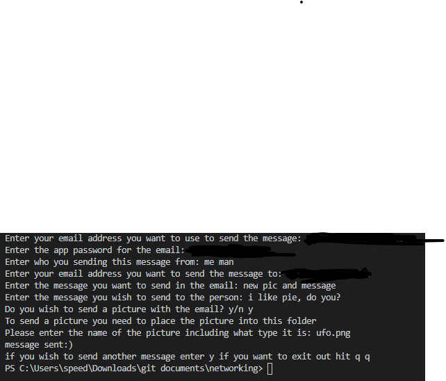
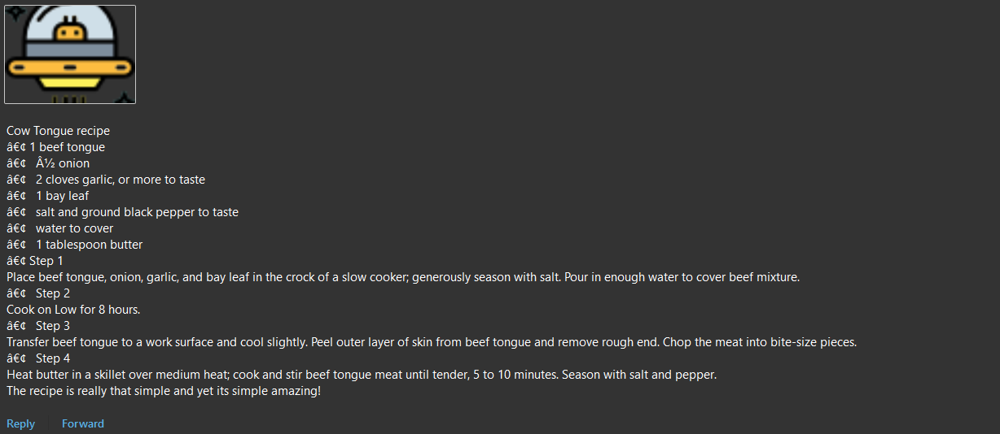

# Summery

This program allows you to send emails with pictures to another person who you wish. For it to work your email needs an app password. For more information, look in the Useful websites section.

## Development enviroment

* Python 3.9.0
* Visual sudio code
* import smtplib

## Exicution

* to exicute the program `Python network.py`
 
 
 

## Useful websites

* [Networking general guide](https://www.tutorialspoint.com/python/python_networking.htm)
* [Python emails guide](https://realpython.com/python-send-email/)
* [Python email examples](https://docs.python.org/3/library/email.examples.html)
